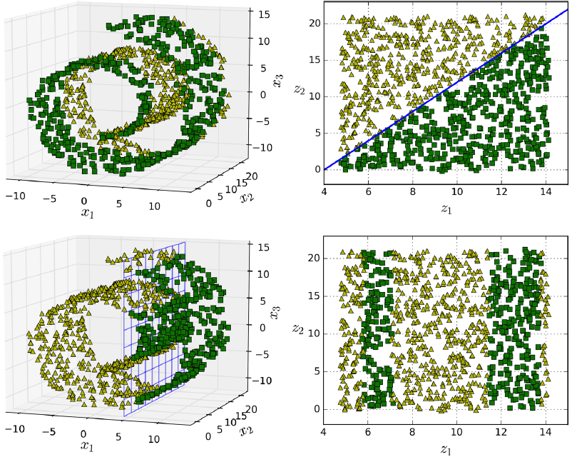
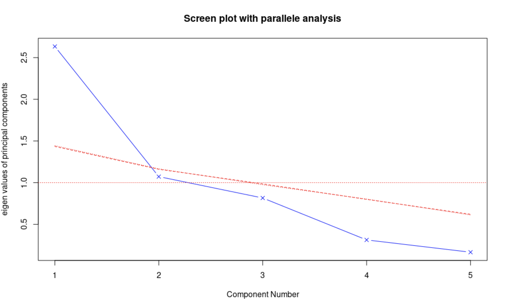
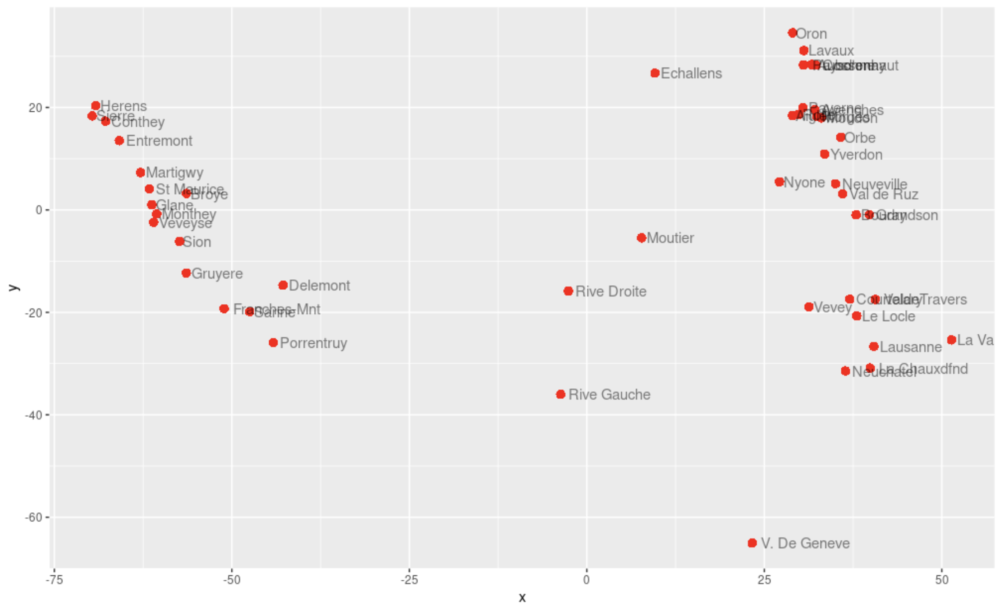

Sources：

- 《R语言实战》(第二版)
- 《机器学习与R语言实战》丘祐玮
- 《机器学习》 周志华
- https://www.jianshu.com/p/75e805ff247c
- https://chenrudan.github.io/blog/2016/04/01/dimensionalityreduction.html
- [http://geopku.com/%E9%99%8D%E7%BB%B4%E4%B8%8E%E5%BA%A6%E9%87%8F%E5%AD%A6%E4%B9%A0/](http://geopku.com/降维与度量学习/)
- 球体积随维度增长图https://book.51cto.com/art/201710/555075.htm
- https://blog.csdn.net/pxhdky/article/details/85248575


前言：主要是从理解降维和用R实现降维这两个层面上来阐述，具体的算法还需要感兴趣的小伙伴另外了解。


### 目录：

1. 降维的简介
2. 降维的分类
3. 降维的方法
4. 降维的具体方法和实现

- 线性：

  PCA主成分分析

  MDS多维尺度分析

  SVD奇异值分解法

- 非线性：

  ISOMAP

  LLE局部线性嵌入法


### 1. 降维的简介

​	在现实生活中，大多数数据集都有高维度的变量或特征，而算法在计算这些高冗余特征时，需要大量的时间，为了降低计算成本，需要对特征进行无损归约，数学上称为降维。

- 维度灾难

  高维情形下，数据样本稀疏，距离计算困难（许多学习方法都涉及距离计算）等问题，会导致数据的过拟合。降维是其中一种缓解维度灾难的途径，当然数据量足够多的话过拟合也可以得到缓解。

  - Q：为什么能够进行降维？

  - A：因为虽然数据是高维的，但是和学习任务相关的也许仅仅是低维分布。

  - Q：如何理解随着维度增高，数据样本稀疏？

  - A：

    
    $$
    V(d, R)=\frac{\pi ^{d/2}}{\Gamma (d/2)+1)}R^{d}
    $$
    
    $$
    V(d, r)=\frac{\pi ^{d/2}}{\Gamma (d/2)+1)}r^{d}
    $$
    
    $$
    \frac{V(d, R)-V(d, r)}{V(d, R)} = \frac{R^{d}-r^{d}}{R^{d}}=1-(\frac{r}{R})^{d}
    $$
    
    $$
    \lim_{d\rightarrow ∞}(\frac{r}{R})^{d}=0
    $$
    

    


### 2. 降维的分类

​	特征提取和特征筛选。

​	特征提取是指将高维数据投影到低维数据空间中，可以分成线性提取和非线性提取两种方法：线性抽取试图找到一个仿射空间能够最好地说明数据分布的变化，非线性方法对高维非线性曲线平面分布的数据很有效；特征筛选是指用特征子集来替代原始特征集，这样实现仅利用一组相关特征构建数据模型的目的。

​	线性和非线性降维：


### 3. 降维的主要方法

​	投影（projection）和流形学习（Manifold Learning），非线性降维一类是基于核的，如 KPCA（Kernel PCA），另一类是流形学习的。

​	下图是七种降维算法的列表：


#### 3.1 投影

​	训练样例不是均匀的分散在所有的维度，部分特征是固定的，部分特征是相关的。因此所有的训练样例实际上可以投影在高维空间中的低维子空间中。

​	如下图中：3维空间中的训练样例都分布在同一个2维平面中，因此所有的样例都能够投影在2维平面上。


​	

​	投影并不总是降维最好的方法，在很多情况下空间可以扭转，如下图：瑞士卷（Swiss roll）数据。


​	直接通过压平第3维，会成为下图左，不同类别样例混在了一起，而实际想要的降维结果是下图右。


#### 3.2 流形学习

​	流形学习自2000年在《Science》上提出，主要思想是从高维采样数据中恢复低维流形结构，即找到高维空间中的低维流形，并求出相应的嵌入映射，以实现维数约简或者数据可视化。它是从观测到的现象中去寻找事物的本质，找到产生数据的内在规律。

​	瑞士卷（Swiss roll）是二维流形的例子。它可以在高维空间中弯曲。更一般地，一个d维流形在n维空间弯曲（其中d＜n）。在瑞士卷的情况下，D＝2和n＝3。基于流行数据进行建模的降维算法称为流形学习（Manifold Learning）。它假设大多数现实世界的高维数据集接近于一个低维流形。

​	流行假设通常隐含着另一个假设：通过流形在低维空间中表达，任务（例如分类或回归）应该变得简单。如下图第一行，Swiss roll分为两类，在3D的空间看起来很复杂，但通过流行假设到2D就能变得简单。

​	但是这个假设并不总是能成立，比如下图第二行，决策线为x=5，2D的的决策线明显比3D的要复杂。因此在训练模型之前先降维能够加快训练速度，但是效果可能会又增有减，这取决于数据的形式。





### 4. 降维的具体方法及实现

#### 4.1. 主成分分析（PCA）

​	特点：是最常用的线性降维方法，期望在所投影的维度上数据的方差最大，这样数据点分散开来能保留更多的信息，PCA是丢失原始数据信息最少的一种线性降维方式，但是它不试图去探索数据内在结构。


##### 4.1.1 含义

​	推导所得的变量成为主成分，是观测变量的线性组合。如第一主成分为：
$$
PC_{1} = a_{1}X_{1} + a_{2}X_{2} + ... +  a_{k}X_{k}
$$
​	是k个观测变量的加权组合，对初识变量集的方差解释性最大，第二主成分也是初始变量的线性组合，对方差的解释性排第二，所有的主成分都和之前所有的主成分正交，由于解释程度越来越差，因此要用较少的主成分来近似全变量集。


##### 4.1.2 用R实现

第一种实现：使用`stats`包中的`prcomp()`函数对`swiss`数据进行PCA处理 【奇异值分解方法】

​	`swiss`数据集收集了1888年瑞士47个法语省份的标准化生育指标以及社会经济指数。 

```R
> data(swiss)
> head(swiss)
             Fertility Agriculture Examination Education Catholic Infant.Mortality
Courtelary        80.2        17.0          15        12     9.96             22.2
Delemont          83.1        45.1           6         9    84.84             22.2
Franches-Mnt      92.5        39.7           5         5    93.40             20.2
Moutier           85.8        36.5          12         7    33.77             20.3
Neuveville        76.9        43.5          17        15     5.16             20.6
Porrentruy        76.1        35.3           9         7    90.57             26.6
> swiss <- swiss[,-1] # 去掉第一列标准化生育指标这一列，剩下的预测项作为输入
> swiss.pca <- prcomp(swiss,center = TRUE,scale=TRUE)
```

```R
> swiss.pca
Standard deviations (1, .., p=5):
[1] 1.6228065 1.0354873 0.9033447 0.5592765 0.4067472

Rotation (n x k) = (5 x 5):
                         PC1         PC2          PC3        PC4         PC5
Agriculture       0.52396452 -0.25834215  0.003003672 -0.8090741  0.06411415
Examination      -0.57185792 -0.01145981 -0.039840522 -0.4224580 -0.70198942
Education        -0.49150243  0.19028476  0.539337412 -0.3321615  0.56656945
Catholic          0.38530580  0.36956307  0.725888143  0.1007965 -0.42176895
Infant.Mortality  0.09167606  0.87197641 -0.424976789 -0.2154928  0.06488642
```

$PC1 = Agriculture*0.524 + Examination*-0.572 + Education*-0.492 + Catholic*0.385 + Infant.Mortality*0.092$

```R
> summary(swiss.pca)
Importance of components:
                          PC1    PC2    PC3     PC4     PC5
Standard deviation     1.6228 1.0355 0.9033 0.55928 0.40675
Proportion of Variance 0.5267 0.2145 0.1632 0.06256 0.03309 # 各成分对应的解释变量比例
Cumulative Proportion  0.5267 0.7411 0.9043 0.96691 1.00000 # 对应变量的累积比例
> predict(swiss.pca,newdata=head(swiss,1)) # 调用predict函数输出主成分的第一行数据值
                  PC1       PC2        PC3      PC4       PC5
Courtelary -0.9390479 0.8047122 -0.8118681 1.000307 0.4618643
```


第二种实现：使用`stats`包中的`princomp()`函数对`swiss`数据进行PCA处理 【相关矩阵或协方差矩阵的特征值计算方法】

```R
> swiss.princomp <- princomp(swiss,center = TRUE,scale=TRUE)
Warning message:
In princomp.default(swiss, center = TRUE, scale = TRUE) :
 extra arguments ‘center’, ‘scale’ will be disregarded 
> swiss.princomp
Call:
princomp(x = swiss, center = TRUE, scale = TRUE)

Standard deviations:
   Comp.1    Comp.2    Comp.3    Comp.4    Comp.5 
42.896335 21.201887  7.587978  3.687888  2.721105 

 5  variables and  47 observations.
> summary(swiss.princomp)
Importance of components:
                           Comp.1     Comp.2     Comp.3      Comp.4      Comp.5
Standard deviation     42.8963346 21.2018868 7.58797830 3.687888330 2.721104713
Proportion of Variance  0.7770024  0.1898152 0.02431275 0.005742983 0.003126601
Cumulative Proportion   0.7770024  0.9668177 0.99113042 0.996873399 1.000000000
> predict(swiss.princomp, swiss[1,])
              Comp.1    Comp.2    Comp.3    Comp.4  Comp.5
Courtelary -38.95923 -20.40504 -12.45808 -4.713234 1.46634
```


第三种实现：使用`psych`包中`principal()` 函数对`swiss`数据进行PCA处理

- R包：`library(psych)`
- 函数：`principal()`

- 步骤：

  1. 数据预处理

     PCA是根据观测变量间的相关性来推导结果。输入的可以是原始矩阵或者相关系数矩阵，输入初始数据后相关系数矩阵会被自动计算，**计算前确保数据中没有缺失值**。

  2. 选择因子模型

     选择PCA（数据降维）还是EFA（潜在结构的发现）。

  3. 判断要选择的主成分数目

     三种特征值判别准则：

     （1）Kaiser-Harris准则：建议保留特征值大于1的主成分

     （2）Cattell碎石验则：保留图形变化最大处之上的主成分。

     （3）平行分析：基于真实数据的某个特征值大于一组随机数据矩阵相应的平均特征值，该主成分可以保留。

     ​	`	fa.parallel()`函数可以同时对三种特征值判别准则进行评价。

     ```R
     > fa.parallel(swiss, 
                 fa = "pc", 
                 n.iter = 100,
                 show.legend = FALSE,
                 main = "Screen plot with parallele analysis")
     > abline(h = 1, col = "red", lty = 3)
     ```

     ​	基于观测特征值的碎石检验（线段和x符号组成）、根据100个随机数据矩阵推导出来的特征值均值（虚线）、大于1的特征值准则（y = 1的水平线）。

     ​	根据保留方差大于1的主成分选择成分1和成分2，根据特征值准则选择也选择成分1和成分2，根据均值则只选成分1. 

     

     

  4. 选择主成分

     ```R
     > principal(r, nfactors = , rotate = , score = )
     ```

     > r：相关系数矩阵或原始数据矩阵
     >
     > nfactors：设定主成分数（默认为1）
     >
     > rotate：制定旋转方法（默认最大方差旋转（varimax））
     >
     > scores：设定是否需要计算主成分得分（默认不需要）

     ```R
     > swiss.principal <- principal(swiss, nfactors = 5, rotate = "none")
     > swiss.principal
     Principal Components Analysis
     Call: principal(r = swiss, nfactors = 5, rotate = "none")
     Standardized loadings (pattern matrix) based upon correlation matrix
                        PC1   PC2   PC3   PC4   PC5 h2      u2 com
     Agriculture      -0.85 -0.27  0.00  0.45 -0.03  1 5.6e-16 1.8
     Examination       0.93 -0.01 -0.04  0.24  0.29  1 2.8e-15 1.3
     Education         0.80  0.20  0.49  0.19 -0.23  1 2.2e-15 2.1
     Catholic         -0.63  0.38  0.66 -0.06  0.17  1 1.1e-15 2.8
     Infant.Mortality -0.15  0.90 -0.38  0.12 -0.03  1 6.7e-16 1.5
     
                            PC1  PC2  PC3  PC4  PC5
     SS loadings           2.63 1.07 0.82 0.31 0.17
     Proportion Var        0.53 0.21 0.16 0.06 0.03
     Cumulative Var        0.53 0.74 0.90 0.97 1.00
     Proportion Explained  0.53 0.21 0.16 0.06 0.03
     Cumulative Proportion 0.53 0.74 0.90 0.97 1.00
     
     Mean item complexity =  1.9
     Test of the hypothesis that 5 components are sufficient.
     
     The root mean square of the residuals (RMSR) is  0 
      with the empirical chi square  0  with prob <  NA 
     
     Fit based upon off diagonal values = 1
     ```

     解读一下数据结果：

     >PC1：这一列表示PC1和每个变量的相关性，可以看到都是高度正相关。
     >
     >h2：成分公因子方差，即主成分对每个变量的方差解释度。
     >
     >u2：成分唯一性（1-h2），方差无法被主成分解释的比例，PHYS是被PC1解释最差的变量。
     >
     >proportion var：第一主成分解释了53%的方差。

  5. 旋转矩阵

     - 为什么要旋转矩阵？

       旋转时为了重新分配各个因子所解释方差的比例，并不改变模型对数据的拟合程度。因子分析需要旋转，当险要解释主成分时，主成分分析分析也可以旋转矩阵。
  
  6. 解释结果
  
  7. 计算主成分或因子得分


##### 4.1.4 和其他的概念的对比

- 主成分分析（PCA）和线性判别分析（LDA）

​	两者本质都是将原始的样本映射到维度更低的样本空间，但PCA是为了让映射后的样本具有最大的**发散性**，LDA是为了让映射后的样本有最好的**分类性能**。


- 主成分分析（PCA）和探索性因子分析（EFA）

​	当多变量数据的变量很多时，了解变量之间的所有交互关系很复杂，假设有20个变量，理解各变量和其他变量的关系时则需要考虑190对两两相互关系。

​	PCA和EFA都是用来探索和简化多变量复杂关系常用的方法，两者有联系和区别。PCA是数据降维技巧，将大量的 **相关** 变量转化为一组很少的 **不相关** 变量，这些无关变量就是主成分。EFA是用来发现一组变量的潜在结构的方法。这个潜在结构怎么理解呢？举个例子：R包`Harman74.cor`中有24个心理检测，这些检测的观测得分是根据4个潜在心理学因素（语言能力、反应速度、推理能力和记忆能力）的加权能力值组合成的，这四个因子是观测变量的结构基础或者“原因”。


#### 4.2 多维尺度分析（MDS）

##### 4.2.1 含义

​	MDS多维尺度分析法是把高维的数据点映射到一个低维的流形上；同时也是一种可视化方法，利用2D或3D的MDS结果投影后的分布和聚集来研究数据的性质，展示多个对象的之间的相似或相异程度。

​	MDS分成计量和非计量两类，计量考虑如何保证降维以后的各对象之间的距离尽可能接近它们在原始空间中的距离，先将距离转换成相似度，在相似度上进行非线性投影；非计量则假设两个空间中对象的距离排名已知，且变换后排名不变。

​	通常情况下选择二维欧氏空间作为目标空间，不过也可以选择其他距离或者更高维的空间。

##### 4.2.2 用R实现

使用计量方法完成

（1）选择二维空间最大值计量MDS分析

```R
> library(ggplot2)
> data(swiss)
> swiss.dist <- dist(swiss)# 计量MDS分析需要获得对象之间的距离，计算距离
> swiss.mds <- cmdscale(swiss.dist,k=2,eig=T)# 选择二维空间最大值进行计量MDS分析，k设置成2即最大投影维度为2，数据点之间的距离以图形方式展现在一个二维散点图上。
> swiss.mds$eig# 查看所有特征值
 [1]  8.839187e+04  2.146623e+04  6.683102e+03  1.041882e+03  6.153710e+02  2.847974e+02  1.718857e-11
 [8]  1.055757e-11  6.353581e-12  4.313025e-12  3.096859e-12  2.205915e-12  2.081644e-12  2.027854e-12
[15]  1.995170e-12  1.768706e-12  1.710028e-12  1.689229e-12  1.368958e-12  1.292917e-12  1.011941e-12
[22]  6.688735e-13  6.069093e-13  5.290955e-13  3.429863e-13  1.641147e-13  7.494036e-14  3.532351e-14
[29] -8.270456e-14 -3.319275e-13 -4.524524e-13 -5.877947e-13 -9.702069e-13 -1.068181e-12 -1.106508e-12
[36] -1.174723e-12 -1.205118e-12 -1.214137e-12 -1.271281e-12 -1.335532e-12 -1.514998e-12 -1.558048e-12
[43] -1.789720e-12 -1.978327e-12 -2.077321e-12 -2.263560e-12 -4.255388e-12
```

（2）查看特征值比例

```R
> prop <- sum(abs(swiss.mds$eig[1:2]))/sum(abs(swiss.mds$eig))# 查看前两个特征值在所有特征值中的比例，检测能否用两个维度的距离来表示高维空间中距离，达到0.8较合适。
> prop
[1] 0.9272036
```

（3）将数据以二维散点图方式实现

```R
> x = swiss.mds$points[,1]
> y = swiss.mds$points[,2]
> ggplot(data.frame(x,y),
+        aes(x,y))+
+   geom_point(shape=16,size=3,colour='red')+
+   geom_text(hjust=-0.1,vjust=0.5,alpha=0.5,aes(label =rownames(swiss)))
```

​	2D可视化结果表示原始高维数据集



（4）使用isoMDS进行非计量MDS分析

```R
> library(MASS)
> swiss.nmmds = isoMDS(swiss.dist, k = 2) # 非计量MDS分析时，不需要计算具体的距离值，仅需要考虑数据点之间的距离先后关系，k = 2投影到二维空间上
initial  value 5.463800 
iter   5 value 4.499103
iter   5 value 4.495335
iter   5 value 4.492669
final  value 4.492669 
converged
```

分析结果按照二维散点图展现：

```R
> plot(swiss.nmmds$points, type = "n", main = "isoMDS(MASS)")
> text(swiss.nmmds$points, rownames(swiss), cex = 0.9, xpd = TRUE)
```


用Shepard曲线展现投影后的距离与原始距离之间的匹配程度，该示例中吻合度很高

```R
> swiss.sh <- Shepard(swiss.dist, swiss.mds$points)
> plot(swiss.sh, pch = ".")
> lines(swiss.sh$x, swiss.sh$yf, type = "S")
```


#### 4.3 奇异值分解（SVD）

##### 4.3.1 含义

​	是矩阵分解的一种形式，通过奇异值分解，将原始矩阵分解成两个正交矩阵和一个对角矩阵，帮助去除从线性代数角度观察存在线性相关的冗余数据，常被应用在特征筛选、图像处理和聚类等很多领域。

##### 4.3.2 用R实现

（1）数据集进行SVD处理，获得分解矩阵

```R
> swiss.svd = svd(swiss)
> str(swiss.svd) # 查看一下它的数据结构，可以看到三个矩阵信息，d是拥有奇异值的对角矩阵
List of 3
 $ d: num [1:6] 713.2 233.8 131.8 74.3 24.8 ...
 $ u: num [1:47, 1:6] -0.104 -0.176 -0.185 -0.138 -0.117 ...
 $ v: num [1:6, 1:6] -0.6681 -0.5093 -0.1347 -0.0883 -0.4839 ...
```

（2）在图中展现SVD列能够解释的变量百分比

```R
> plot(swiss.svd$d^2/sum(swiss.svd$d^2), type = "l", 
+      xlab = "singular vactor",
+      ylab = "variance expalined")
```

​	从图中可以看到第一奇异值能够解释80%的变量


（3）比较原始数据集以及奇异值重构后的数据集之间的差别

```R
> swiss.recon = swiss.svd$u[,1] %*% 
+   diag(swiss.svd$d[1],
+        length(1), length(1)) %*%
+   t(swiss.svd$v[,1])
# 用%*%表示矩阵乘法而不是用*表示
# diag函数可以用来提取矩阵的对角元素，并将它保存成向量的格式。
> par(mfrow = c(1,2))
# 1页2图
> image(as.matrix(swiss), main = "swiss data image")
> image(swiss.recon, main = "reconstructed image")
```


#### 4.4. ISOMAP进行非线性降维

##### 4.4.1 含义

​	是流形学习方法，支持线性空间到非线性数据结构的转换，由于数据采用非线性结构，在ISOMAP方法中使用几何距离代替了MDS中使用的欧式距离度量，是非线性降维的方式。

​	可分为四步：

- 确定每个点的临近点
- 构建临接图
- 计算两节点间的最短路径
- 通过MDS分析找到数据间的低维嵌入

##### 4.4.2 用R实现

（1）准备数据

```R
> library(RnavGraphImageData)
> library(vegan)
> op <- par(mar=c(4,4,1,1)+0.2, mfrow=c(2,2))# 将几个图结合成同一背景下
> data(BCI)
> dis <- vegdist(BCI)# 调用vegdist计算对象之间的相异度,距离度量方法为欧式距离
> tr <- spantree(dis)# 最小生成树
> pl <- ordiplot(cmdscale(dis), main="cmdscale")
> lines(tr, pl, col="red")
> ord <- isomap(dis, k=3)# 调用isomap进行降维，k=3
```

```R
> pl <- plot(ord, main="isomap k=3")
> lines(tr, pl, col="red")
> pl <- plot(isomap(dis, k=5), main="isomap k=5")
> lines(tr, pl, col="red")
> pl <- plot(isomap(dis, epsilon=0.45), main="isomap epsilon=0.45")
> lines(tr, pl, col="red")
```

红色是最小生成树


#### 4.5 **局部线性嵌入**（LLE）进行非线性降维

##### 4.5.1 含义

​	假设数据中每个点可以由其近邻的几个点重构出来。降到低维，使样本仍能保持原来的重构关系，且重构系数也一样。

​	步骤：

​	第一步是求K近邻，使用KNN等算法通过欧式距离或其它规则找出与自身最邻近的K个点。（在此步骤中，唯一可以控制的参数将是临近点个数K）

​	第二步，对每一个样本利用它在邻域的线性关系求权重系数矩阵W。

​	第三步，利用权重系数在低维空间重构样本数据。

##### 4.5.2 用R实现

```R
> library(lle)
> library(rgl)
> data(lle_scurve_data)
> X <- lle_scurve_data
> Y <- lle(X,m=2,k=12,id=TRUE)$Y# 处理数据集，保留维度设为2,邻近点设为12。
finding neighbours
calculating weights
intrinsic dim: mean=2.47875, mode=2
computing coordinates
```


```R
> plot(Y,main="embedded  data",xlab=expression(y[1]),ylab=expression(y[2]))# 嵌入数据的2D散点图
> plot_lle(Y,X,FALSE,col="red",inter=TRUE)#调用plot_lle函数展示降维结果
```


其他的降维方法：

- 拉普拉斯特征映射（Laplacian Eigenmaps,LE）
- Sammon映射
- CCA
- t-sne（常用于识别肿瘤亚群等等）
- ......


